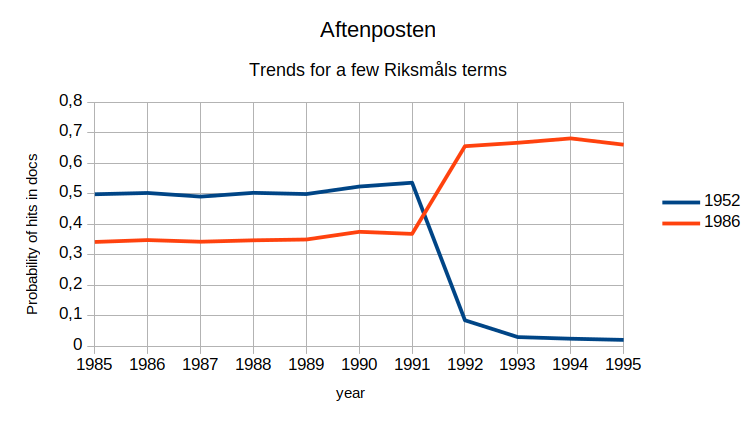

# language-detect

This repository defines a set of rules and statistics to identify written variants of the [Norwegian language](https://en.wikipedia.org/wiki/Norwegian_language). Some of these language variants are very similar to the base variant, so special measures must be taken to identify the correct variant. A plain [naïve Bayes classifier](https://en.wikipedia.org/wiki/Naive_Bayes_classifier) with N-grams is not enough to get a high quality detection on short text fragments.

- **Note 1**: *The repository is for the actual experiments, and it is not intended to be production code.*
- **Note 2**: *The repository does not include training data, as it is not available under a free license.*

Alternate approaches not investigated here of the same problem are [maximum likelihood estimation](https://en.wikipedia.org/wiki/Maximum_likelihood_estimation) (MLE) and [siamese neural network](https://en.wikipedia.org/wiki/Siamese_neural_network). One common method for MLE is to use found trigrams over a subset for a specific languages, and then normalize over a set of found trigrams over a union of subsets for all languages. One method for siamese networks is to use the trigrams as embeddings as is, or they can be transformed into new embeddings. An experimental approach is to use a [recurrent neural network](https://en.wikipedia.org/wiki/Recurrent_neural_network) as the first stage.

## Norwegian written forms

The core purpose of the experiments are to create statistics for detection of Norwegian language variants. There are several unique problems with this, as the variants are quite close to each other in spelling. In particular; [Høgnorsk](https://en.wikipedia.org/wiki/Høgnorsk) is similar to [Nynorsk](https://en.wikipedia.org/wiki/Nynorsk), and [Riksmål](https://en.wikipedia.org/wiki/Riksmål) is very similar to [Bokmål](https://en.wikipedia.org/wiki/Bokmål). The variant [Moderat Bokmål](https://no.wikipedia.org/wiki/Moderat_bokmål) is in between Bokmål and Riksmål, and is even harder to identify correctly.

It is possible to create a first approximation to the language variants by using coarse classification, and then create a refined set with only the acceptable documents. Sources using several alternate language variants can then be used for training the classifier.

A very short list of Norwegian newspapers and their use of language variants

- [Aftenposten](https://en.wikipedia.org/wiki/Aftenposten) used Riksmål according to [Riksmålsordlisten](https://en.wikipedia.org/wiki/Riksm%C3%A5lsordlisten) from 1952 up to 1989, from 1990 Riksmål according to definitions by [Det norske akademi](https://en.wikipedia.org/wiki/Det_norske_akademi) as of 1986, from 1992 started to transition to an [internal thesaurus](https://bibsys-almaprimo.hosted.exlibrisgroup.com/permalink/f/1fb9390/BIBSYS_ILS71464468560002201) published in March 1993, and late 90s it started moving towards [Moderat Bokmål](https://no.wikipedia.org/wiki/Moderat_bokm%C3%A5l) ([Store norske ordbok](https://bibsys-almaprimo.hosted.exlibrisgroup.com/permalink/f/1fb9390/BIBSYS_ILS71491256310002201)) which became official in 2006
- [Dagbladet](https://en.wikipedia.org/wiki/Dagbladet) uses Radikalt Bokmål
- [VG](https://en.wikipedia.org/wiki/Verdens_Gang) uses Moderat Bokmål

An extract of articles that contain a few marker words from Aftenposten shows the change over time. In this case one group of marker words are “efter” (“after”), “nu” (“now”), “igår” (“yesterday”), “idag” (“today”), and “imorgen” (“tomorrow”). These words' comes from the language norm for Riksmål from 1952, and are shown in blue. The other group of marker words are “etter” (“after”), “nå” (“now”), “i går” (“yesterday”), “i dag” (“today”), and “i morgen” (“tomorrow”). These words' comes from the language norm for Riksmål from 1986, and are shown in red.

**Figure 1**: *Trends for a few terms in the Riksmål language variant.*

The language norm from 1952 went out of use some time after the editor-in-chief left in the fall of 1989. In March 1993, the new [Aftenposten's spelling glossary](https://bibsys-almaprimo.hosted.exlibrisgroup.com/permalink/f/1fb9390/BIBSYS_ILS71464468560002201) was published. Considerable changes are visible in the months before the publication.

For an alternate list, see [Wikipedia: Liste over norske aviser etter målform](https://no.wikipedia.org/wiki/Liste_over_norske_aviser_etter_m%C3%A5lform)

## Overview

The language files are split into three sets for each language variant; one N-gram set, one affix set, and one term set.

The N-gram statistics is a bit unusual by using a space replacement character. This set will catch some affixes, but not the long ones, and the statistics will be somewhat diffuse compared with the affix rules and the keywords. The N-grams might catch infix rules that are otherwise lost.

- **Note 3**: *This is tested, and works as expected.*

As some affixes can be quite long in Norwegian, and also stacked, like “bilistene” (“the motorists”, definite plural) and “bilkjøringen” (“to drive a car”, definite singular), separate statistics is built for the affix rules to avoid very long N-grams.

- **Note 4**: *This is only partially tested, and there  are no conclusions whether this works better or worse.*

The keywords are a list of known words where the written language forms diverge. This is quite interesting as some words are quite good markers, especially for older texts. The keywords have rules to control inflection.

- **Note 5**: *This is not tested.*

## Usage

Each statistic gives a count of the number of occurrences after cleanup in the export script. The capitalized words are removed from the text, literal quotes are removed, and the terms that don't pass spellchecking are removed. Spellcheckers for Bokmål and Nynorsk are pretty forgiving, so most of the language variants should pass as acceptable. That is a spellchecker for Bokmål will mostly accept Riksmål, and a spellchecker for Nynorsk will mostly accept Høgmål.

Capitalized words are removed on an assumption that it is highly likely that such words are names, and thus are noise as they often comes from other cultural areas.

Literal quotes are removed on an assumption that it is highly likely they contain snippets of text in other languages, or spoken text which might have other properties than written text.

Whatever don't pass the spellchecker is removed too, on the assumption that the term seems so strange that it is unlikely they are a good source for language detection. This step is rather dangerous, as it can easily remove what is indicative for a specific language variant.

The *prior probability of the language variant* is given in the marginals section of the statistics, while the prior probability of the predictor must be calculated over all actual variants. If the purpose is only to compare the posterior probability, i.e. identification of the language variant, then the prior probability of the predictor can be dropped.

### N-gram statistics

These statistics describe the differences in use of N-grams, that is the *conditional probability for observing the N-gram given the language variant*.

N-grams with *N* equal to 1 are only generated for Bokmål and Nynorsk, as the variants have non-significant differences. N-grams with *N* equal to 2, 3, and 4, are generated for various variants. Increasing *N* gives increased differences during classification, but also increased data size aka size of JSON files. With increasing *N* there will also be an increasing lack of evidence, thus it will be a drop in differences during classification.

These statistics are completely built by the script, with N-grams extracted from the (not included) training data.

### Affix statistics

These statistics describe the differences in use of affixes, that is the *conditional probability for observing the affix given the language variant*.

There are at least two different possible implementations of affix statistics; either handling affixes in a separate structure or in the same structure as the N-grams.

These statistics are built with the affix files as patterns, with terms extracted from the source texts.

### Keyword statistics

These statistics describe the differences in use of keywords, that is the *conditional probability for observing the keywords given the language variant*.

Again there are at least two different possible implementations of keyword statistics; either handling keywords in a separate structure or in the same structure as the N-grams.

These statistics are built with the affix files and keywords as patterns, with terms extracted from the source texts.

### JSON files

#### Metadata

This covers the fields for *@metadata*

- *title* – a title for the data set, usually a short descriptive phrase
- *comment* – a comment about the data set, usually a longer descriptive phrase
- *license* – the license covering the generated json structure
- *generator* – the generator that created the json stucture
- *authors* – one or more authors for the additional information, could be a full name or a nick name

#### N-grams

This covers the fields for *ngrams*

- *language* – the language for the data set, usually an established IANA code
- *version* – the major and minor version for the data structure, aka structure changes and data index
- *minimum* – the minimum number of hits to enlist an entry
- *size* – the actual size for the N-grams
- *marginals* – the overall statistics
  - *documents* - the number of documents analyzed to create this data set
  - *words* – the number of words extracted from all documents in this data set
  - *fragments* – the number of generated fragments (N-grams) from all words in this data set
  - *excludes* – the number of fragments (N-grams) excluded because they are to short
- *ngrams* – each entry is a N-gram with its conditional probability

## Sources

- Gundersen, Dag; Engh, Jan; Fjeld, Ruth Vatvedt; [Håndbok i norsk – Skriveregler, grammatikk og språklige råd fra a til å](https://bibsys-almaprimo.hosted.exlibrisgroup.com/primo-explore/fulldisplay?docid=BIBSYS_ILS71482075340002201&context=L&vid=BIBSYS&search_scope=default_scope&tab=default_tab&lang=no_NO) Kunnskapsforlaget (1995) ISBN 978-82-573-0562-8
- Bleken, Brynjulv; [Riksmål og liberalisert bokmål – en sammenlignende oversikt](http://urn.nb.no/URN:NBN:no-nb_digibok_2014020606085) Oslo (1980), ISBN 8299062802
- Lie, Svein; [Innføring i norsk syntaks](http://urn.nb.no/URN:NBN:no-nb_digibok_2009021804107) Universitetsforlaget Oslo (2003) ISBN 978-82-15-00454-9 ([4. edition](http://urn.nb.no/URN:NBN:no-nb_digibok_2007092000090))
- Kuldbrandstad, Lars Andreas; [Språkets mønstre](http://urn.nb.no/URN:NBN:no-nb_digibok_2011082605006) Universitetsforlaget Oslo (2015) ISBN 978-82-15-00771-7 ([2. edition](http://urn.nb.no/URN:NBN:no-nb_digibok_2008082100028))
- Saeed, John I.; *Semantics* Wiley-Blackwell (2009) ISBN 978-1-4051-5639-4
- Johnson, Keith; *Quantitative Methods in Linguistics* Blackwell Publishing (2008) ISBN 978-1-4051-4425-4
- Jurafsky, Daniel; Martin, James H.; *Speech and Language Processing* Pearson Education (2009) ISBN 978-0-13-504196-3
- Hastie, Trevor; Tibshirani, Robert; Friedman, Jerome; [The Elements of Statistical Learning](https://bibsys-almaprimo.hosted.exlibrisgroup.com/primo-explore/fulldisplay?docid=BIBSYS_ILS71505101120002201&context=L&vid=BIBSYS&search_scope=default_scope&isFrbr=true&tab=default_tab&lang=no_NO) Springer Science + Business Media (2009) ISBN 9780387848570

## Other libraries

- [Google Code: languagedetection](https://code.google.com/archive/p/language-detection/#!) (also [GitHub: shuyo/language-detection](https://github.com/shuyo/language-detection))
- [GitHub: optimaize/language-detector](https://github.com/optimaize/language-detector)
- [GitHub: CLD2Owners/cld2](https://github.com/CLD2Owners/cld2)
- [Github: wooorm/franc](https://github.com/wooorm/franc) (also [Github: kapsteur/franco](https://github.com/kapsteur/franco))
